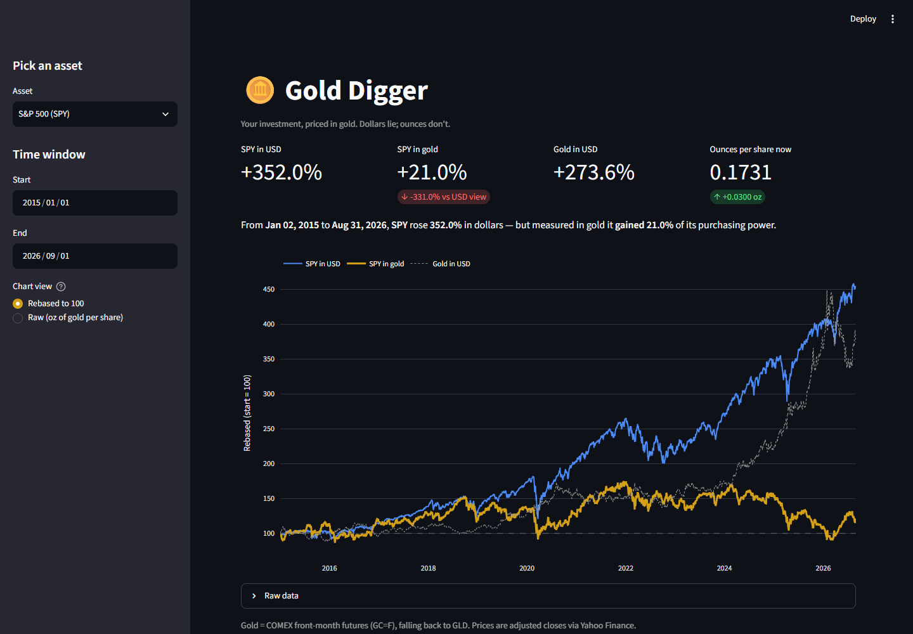

# 🪙 Gold Digger

**See what your investments are really doing.**



Dollars are a rubber ruler. Gold Digger re-prices any stock, ETF, index, or crypto in
troy ounces of gold, so you can see whether an asset actually gained purchasing power
or just rode the currency's decline.

> Since 2015, Apple is up ~1,245% in dollars — but only ~266% in gold.
> Three-quarters of that "gain" was the measuring stick shrinking.

## Features

- Pick a preset asset (SPY, QQQ, AAPL, NVDA, BTC-USD, …) or type any Yahoo Finance ticker
- Set any date window
- **Rebased view** — the asset in USD, the asset in gold, and gold itself, all starting at 100
- **Raw view** — ounces of gold one share buys, over time
- Headline metrics: USD return, gold-denominated return, gold's own return, ounces-per-share now
- One plain-English sentence with the verdict

## Quick start

```bash
git clone https://github.com/ncypher/gold_digger.git
cd gold_digger
pip install -r requirements.txt
streamlit run app.py
```

Opens at `http://localhost:8501`.

## How it works

```
asset_in_gold = asset_close_usd / gold_close_usd
```

That's it — ounces of gold per share. Everything else is presentation.

- **Gold price:** COMEX front-month futures (`GC=F`), falling back to the `GLD` ETF if futures history is thin for the window
- **Asset prices:** dividend/split-adjusted closes from Yahoo Finance via [`yfinance`](https://github.com/ranaroussi/yfinance)
- Data is cached for one hour per ticker/window

## Caveats

- `yfinance` is free and unofficial. Fine for a demo; swap in a real market-data provider if this grows legs.
- Gold futures ≠ spot, and `GLD` carries an expense ratio. Both are close enough for the purpose here.
- This is an analysis toy, not investment advice.

## Origin

Sparked by a podcast aside — the idea that a stock chart priced in gold shows you
something a dollar chart hides. Built in an afternoon to see if it was true. It was.

## License

MIT
